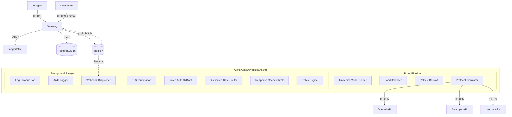

# AIlink — System Architecture

> **Comprehensive Technical Reference**
>
> This document details the internal architecture, data flows, and component design of AIlink. It is intended for core contributors and system architects.

---

## 1. High-Level Design

AIlink is a high-performance, security-focused reverse proxy for LLM and API traffic. It sits between AI agents and upstream providers (OpenAI, Anthropic, internal APIs), acting as a centralized control plane for observability, security, and cost management.

### Core Philosophy
1.  **Zero Trust**: No request passes without explicit token validation and policy evaluation.
2.  **Streaming First**: usage of `Bytes` and streaming bodies to minimize memory footprint; buffering occurs only when policy inspection requires it.
3.  **Hot Path Optimization**: Critical path metadata is cached in-memory (L1) and Redis (L2) to minimize database hits.
4.  **Fail-Close**: Security failures (auth, policy errors) always block the request. Network failures (upstream) trigger circuit breaking.

---

## 2. System Diagram

---

## 3. Component Deep Dive

### 3.1. The Proxy Pipeline (Hot Path)

Requests flow through a stack of **Tower Middleware** layers. Each layer is isolated and composable.

1.  **TLS Termination**: Handled by the intake layer (or external load balancer in clustered setups).
2.  **Trace Layer**: Assigns an OpenTelemetry trace ID to the request.
3.  **Security Headers**: Injects `Strict-Transport-Security`, `X-Content-Type-Options`, `X-Frame-Options` to prevent browser-based attacks.
4.  **CORS**: Enforces `DASHBOARD_ORIGIN` for browser clients.
5.  **Authentication**:
    *   **Management API**: Validates `Authorization: Bearer <admin-key>` against `api_keys` table. Checks `role` (Admin/Editor/Viewer) and `scopes` (e.g., `tokens:write`).
    *   **Proxy API**: Validates `Authorization: Bearer ailink_v1_...`. Resolves Virtual Token ID to `project_id`.
    *   **Dashboard Proxy**: Validates `DASHBOARD_SECRET` and `X-Dashboard-Token`.
6.  **Rate Limiting (L1)**: Checks in-memory checks for DoS protection.
7.  **Policy Engine (Pre-Flight)**:
    *   Resolves `request.*`, `agent.*`, `usage.*` fields.
    *   Evaluates JSON-logic rules.
    *   Executes actions: `deny`, `rate_limit` (Redis-backed), `spend_cap` (DB-backed atomic check).
8.  **Human-in-the-Loop (HITL)**: If triggered, suspends the request, notifies Slack/Dashboard via Redis Stream, and waits for `approval` or `rejection`.
9.  **Response Cache (Read)**: Checks Redis for a semantic match (hash of model + messages + args). Returns immediately on hit.
10. **Load Balancer + Circuit Breaker**:
    *   Reads per-token `CircuitBreakerConfig` from the resolved token (`circuit_breaker` JSONB).
    *   Selects an upstream using **weighted round-robin within priority tiers**.
    *   CB states: `closed` (healthy) → `open` (blocked after N failures) → `half_open` (cooldown elapsed) → `closed` (recovered).
    *   When `enabled: false`, CB is bypassed entirely — all upstreams are always routable (useful for dev tokens).
    *   Adds `X-AILink-CB-State` and `X-AILink-Upstream` response headers for client-side observability.
11. **Model Router**:
    *   **Detection**: Identifies provider (OpenAI, Anthropic, Gemini) via model prefix (e.g. `claude-3`).
    *   **Translation**: Converts incoming OpenAI-format body to target provider format (e.g., specific JSON structure for Gemini).
12. **Upstream Request**:
    *   Injects the **Real API Key** (decrypted from Vault).
    *   Applies **Retries** with exponential backoff and Jitter.
    *   Respects `Retry-After` headers.
13. **Response Handling**:
    *   **Stream Processing**: Captures chunks for audit logging.
    *   **Translation (Reverse)**: Normalizes response back to OpenAI format.
    *   **Policy Engine (Post-Flight)**: Redacts PII (`response.body.*`) or alerts on specific errors.
    *   **Cache Write**: Stores successful LLM responses in Redis.

### 3.2. Policy Engine

The heart of AIlink's control plane. Policies are JSON documents that bind **Conditions** to **Actions**.

*   **Phases**:
    *   `pre`: Before upstream request (Access Control, Limits).
    *   `post`: After response received (Redaction, Auditing).
*   **Modes**:
    *   `enforce`: Blocks/modifies requests.
    *   `shadow`: Logs violations but allows requests (for testing).
*   **Field Resolution**: Uses `src/middleware/fields.rs` to extract data via dot-notation:
    *   `request.body.messages[0].content`: JSON path extraction.
    *   `usage.spend_today_usd`: Real-time Redis counter.
    *   `context.time.hour`: UTC time.
*   **Operators**: `eq`, `neq`, `gt`, `lt`, `in`, `contains`, `starts_with`, `regex`, `glob`.
*   **Actions**:
    *   `deny`: Returns 403/429.
    *   `rate_limit`: Increments Redis sliding window counter.
    *   `store_audit`: Forces audit log level.
    *   `redact`: Scrubs sensitive patterns (SSN, API Key) from body.
    *   `webhook`: Dispatches async event.
    *   `transform`: Modifies headers/body (e.g., inject system prompt).

### 3.3. Identity & Security

*   **Virtual Tokens**: `ailink_v1_...`. Randomly generated pointer to a configuration.
    *   **Isolation**: Tokens belong to a `project_id`. Access across projects is blocked (IDOR protection).
    *   **Capabilities**: Tokens are scoped to specific upstreams or services.
*   **Secret Management (The Vault)**:
    *   **Envelope Encryption**:
        *   **Master Key (KEK)**: 32-byte key from `AILINK_MASTER_KEY` env var. Never stored in DB.
        *   **Data Key (DEK)**: Unique 256-bit key per credential. Stored in DB encrypted by KEK.
        *   **Ciphertext**: The actual API key, encrypted by DEK using **AES-256-GCM** with a unique 96-bit nonce.
    *   **Lifecycle**: Decrypted only in memory, for the duration of the request context, then zeroed.
*   **SSRF Protection**:
    *   Webhook dispatcher validates URLs.
    *   Rejects private IP ranges (10.0.0.0/8, 192.168.0.0/16, etc.).
    *   Rejects cloud metadata services (169.254.169.254).
    *   Enforces HTTPS (except localhost in dev).
*   **Timing Attack Mitigation**:
    *   All key comparisons (Admin Key, Dashboard Secret) use `subtle::ConstantTimeEq`.

### 3.4. Observability & Auditing

*   **Audit Logging**:
    *   **Async Write**: Logs are pushed to a channel, batched, and written to `audit_logs` (PostgreSQL partition).
    *   **Levels**:
        *   `0`: Metadata only (tokens, latency, cost).
        *   `1`: PII-scrubbed bodies.
        *   `2`: Full capture (automatically expired/downgraded after 24h).
    *   **Cost Tracking**: Calculates token usage and USD cost based on model pricing (configurable).
*   **Tracing**:
    *   OpenTelemetry (OTLP) export to Jaeger/Tempo.
    *   Spans for: `middleware`, `db_query`, `redis_op`, `upstream_request`, `policy_eval`.
*   **Metrics**:
    *   Request counts, Latency histograms, Error rates.

### 3.5. Background Jobs

*   **Cleanup (`jobs/cleanup.rs`)**:
    *   Runs hourly.
    *   Identifies Level 2 audit logs older than 24 hours.
    *   **Downgrades**: Sets `log_level = 0`.
    *   **Strips**: Updates `request_body` / `response_body` to `[EXPIRED]` to reclaim storage.
*   **Key Rotation**:
    *   (Enterprise) Rotates upstream API keys based on policy schedules.

---

## 4. Data Architecture

### 4.1. PostgreSQL (System of Record)
*   **`tokens`**: Virtual identities, upstream config, policy attachment, log level, and `circuit_breaker` (JSONB) per-token CB config.
*   **`credentials`**: Encrypted provider keys.
*   **`policies`**: Rulesets (JSONB).
*   **`api_keys`**: Management API access (RBAC).
*   **`audit_logs`**: Partitioned by month. High-volume write target.
*   **`spend_caps`**: Daily/Monthly limits per token.
*   **`model_pricing`**: Dynamic cost-per-1k-token by model and provider.

### 4.2. Redis (System of Speed)
*   **Cache (`cache:*`)**:
    *   Stores resolved Token → Policy + Credential mappings.
    *   TTL: 5-10 mins. Invalidated via Pub/Sub on updates.
*   **Counters (`usage:*`)**:
    *   `usage:{token_id}:requests:{window}`: Rate limit counters.
    *   `spend:{token_id}:daily:{YYYY-MM-DD}`: Atomic spend tracking.
*   **Streams (`stream:*`)**:
    *   `stream:approvals`: HITL request queue.
    *   `stream:approval_responses`: Operator decisions.
*   **LLM Cache (`response:*`)**:
    *   Stores `SHA256(request_signature) -> response_payload`.

---

## 5. Integrations

*   **Webhooks**:
    *   **Events**: `policy_violation`, `spend_cap_exceeded`, `rate_limit_exceeded`.
    *   **Delivery**: Fire-and-forget POST requests to configured URLs.
*   **Slack**:
    *   Interactive Block Kit messages for HITL approvals.
    *   Real-time alerts for critical failures.

---

## 6. Development & Deployment

*   **Docker**:
    *   Multi-stage builds (Planner + Builder + Runtime) for minimal image size (~100MB).
    *   Non-root user `ailink` for security.
*   **Configuration**:
    *   `Config` struct loads from Environment Variables + `.env` file.
    *   Strict typing and validation at startup (fails fast if config is invalid).

